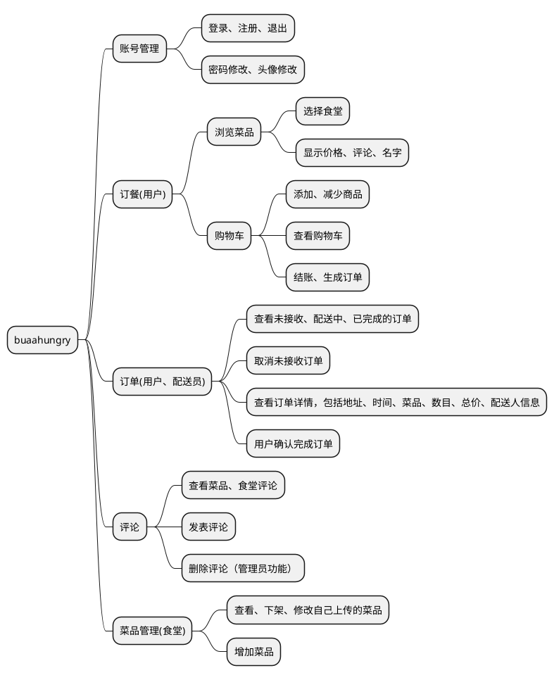

### 前端结构

assets:

- 网站ico等静态图片资源

components:

- 相对独立的重用较多的子组件
- 包括:  顶栏、底栏、详情页

router:

- 前端路由文件，单文件统一控制跳转路径

views:

- 应用界面的vue文件，包括主页(菜品管理 or 骑手订单页 or 食堂展示)，食堂点餐页面，用户页面，订单页面，购物车页面，登录页，注册页
- 每个大页面有自己的小组件文件夹

api:

- 封装的axios接口，处理请求发出前的身份添加和接收后的错误预处理

### 客户端环境

```
"dependencies": {
    "@vant/weapp": "^1.10.3",
    "axios": "^1.6.2",
    "core-js": "^3.8.3",
    "mitt": "^3.0.0",
    "vant": "^3.4.9",
    "vue": "^3.2.33",
    "vue-router": "^4.0.3",
    "vuex": "^4.0.0"
  },
  "devDependencies": {
    "@babel/core": "^7.12.16",
    "@babel/eslint-parser": "^7.12.16",
    "@types/node": "^20.9.3",
    "@vue/cli-plugin-babel": "~5.0.0",
    "@vue/cli-plugin-eslint": "~5.0.0",
    "@vue/cli-plugin-router": "~5.0.0",
    "@vue/cli-plugin-vuex": "~5.0.0",
    "@vue/cli-service": "~5.0.0",
    "@vue/eslint-config-standard": "^6.1.0",
    "babel-plugin-import": "^1.13.5",
    "eslint": "^7.32.0",
    "eslint-plugin-import": "^2.25.3",
    "eslint-plugin-node": "^11.1.0",
    "eslint-plugin-promise": "^5.1.0",
    "eslint-plugin-vue": "^8.0.3",
    "less": "^4.0.0",
    "less-loader": "^8.0.0"
```

### 功能结构



#### 账号管理

- 登录: 通过输入学工号和对应的正确密码，登录进入功能界⾯，否则会无法进入功能页面。
- 注册: 输入学工号，电话号码，昵称，密码进行注册，后端检验合法性后注册成功
- 登出: 在账号管理界面登出，同时消除localStorage中持有的用户Token
- 修改密码：在账号管理界面输入原密码新密码进行密码修改
- 修改头像：在用户主页点击头像后上传本地头像进行头像修改

#### 订餐

##### 浏览菜品

- 查看所有的食堂，选择对应食堂浏览、选择其菜品
- 点击菜品可以进入详情页面，看到菜品名、价格、详情和评论等信息

##### 购物车

- 查看购物车: 购物车页面查看自己选择的全部菜品
- 添加减少商品: 订餐界面选择菜品加入购物车，购物车页面也支持已选商品的份数增减
- 生成订单: 自动计算商品总价格，填写地址和期望送达时间后可以生成未接单订单等待配送员接收

#### 订单

- 查看未接单、配送中、已完成的订单: 点击订单卡之后可以查看订单详情，包括: 送达时间、地址、总价、菜品、数目、状态、评价
- 取消未接单订单: 未接单订单可以取消，取消后订单状态变为取消
- 确认完成订单: 配送员完成订单后，用户可以确认订单完成，完成订单后订单状态变为已完成

#### 评论

- 查看菜品、食堂评论：在对应界面点击评论按钮可以查看所有评论
- 发表评论；在菜品和食堂评论区填写评论后发表，在评论详情页可以对别人的评论发表评论
- 删除评论（管理员功能）：在管理员用户的主页进入评论管理界面，管理员可以删除任何评论

#### 菜品管理

- 查看、下架、修改自己上传的菜品：在主页点击管理按钮或者在底栏点击管理按钮进入管理界面，管理界面可以查看、下架、修改自己上传的菜品
- 增加菜品：管理页面增加菜品，增加菜品需要选择菜品图片、名称、价格、描述

## 重要功能实现

### 鉴权实现

#### token缓存

为了鉴别用户⾝份，我们采⽤ token 唯⼀标识。

- 用户登录后，服务器校验用户⾝份并返回⼀个 token，客户端在 localStorage 中缓存 token
- axios拦截随后的每⼀次请求并在请求头中添加该 token 交由服务器校验

使用localStorage是考虑到 LocalStorage 永远不会离开浏览器，并且会一直保留在那里，可以减少用户的登录操作次数。相反，Session Storage一旦浏览器选项卡/窗口关闭，存储在其中的数据就会被删除。

#### 路由守护

```js
router.beforeEach((to, from, next) => {
  if (to.meta.isAuth) {
    if (localStorage.getItem('token')) {
      next()
    } else {
      Toast('请登录')
      router.push('/login')
    }
  } else {
    next()
  }
})
```

为了防⽌用户直接通过⽹址进行恶意跳转，我们可以设置⼀个路由守卫根据 localStorage 中有无 token 属性来验证用户是否登录，但是这并不完全根除这个问题，还需要后端校验 token 有效性避免用户伪造请求

```js
axios.interceptors.response.use(
  response => {
    if (response.data.status === -2) {
      Toast.fail({
        message: '登录过期',
        forbidClick: true
      })
      router.push('/login')
    } else if (response.data.status === -1) {
      Toast.fail({
        message: '身份异常',
        forbidClick: true
      })
      router.push('/login')
    } else {
      return response
    }
  },
  error => {
    Toast.fail('请求异常')
    // console.log(error)
    return Promise.reject(error)
  }
)
```

拦截响应并返回错误信息，避免因 token 过期或无效导致页面无法正常显示

### 图片上传与下载

直接用base64字符串进行传输，因为图片数据本身很小，而用base64编码后，数据量会膨胀30%左右，但可以减少请求次数，提高效率

### 前端快速更新

#### 渲染优先

在dom元素挂载完成之后再请求数据更新dom元素，减少不必要的请求，提高前端响应速度，配合弹出层等容器的使用可以实现类似懒加载的效果

#### 监听器

监听请求值或者props值变化触发元素更新，减少同步请求引起，提高前端响应速度

#### 响应式数据修改

增删改某元素值时，在请求成功后，尝试直接修改前端对应的响应式对象的属性值，增加和删除对象同理，尽量不在修改后再次发出查询请求，减少请求次数

```js
axios.post('/cancelOrder', { order_id: data.orderDetail.id }).then((response) => {
  switch (response.data.status) {
    case 0:
      Toast.success('订单已经删除')
      // 请求成功，前端自动同步更改
      data.orderData[0].splice(OrderIndex, 1)
      data.showDetail = false
      break
    case 1:
      Toast.success('订单不存在')
      break
    default:
      Toast.fail('未知错误')
      break
  }
})
```

这种手段配合dom元素标记key属性，可以实现在不刷新页面的情况下，快速定位dom元素并进行更新，提高前端响应速度

#### 弹出层

使用弹出的主要考虑以下几点:

- router传参比较复杂，不适合传大量数据
- 会引起大量的页面刷新，带来大量的请求和加载
- 使用缓存解决上述问题会带来新的问题，比如前后端数据不同步，内存消耗大

弹出层配合监听器使用可以减少页面跳转并避免重复的请求，使用弹出层的几个页面分别为订单详情、菜品详情这类可能大量重复点开的详情页，别的页面使用价值不大

### 移动端适配

- 移动端组件库vant
  经过前期考察发现这个 ~~十分干净优美的~~ 移动端组件库，使用它的 version3 版本，有效减少底层组件编写，专注于逻辑和用户体验
- 一些自适应
  尽量少使用绝对宽度，包括字体使用相对大小、容器宽度采用相对值、动态计算值这类经典的自适应手段，由于定位是移动端开发，兼容横屏但不是很美观
- 专注功能
  因为移动设备屏幕小的特点，尽量减少无意义的图片背景，过渡效果，每个页面基本只使用填充了信息的容器进行合理布局，加载动效和空页面等效果是考虑用户体验添加的

## 总结

数据库大作业开发前前后后经历了四个月，