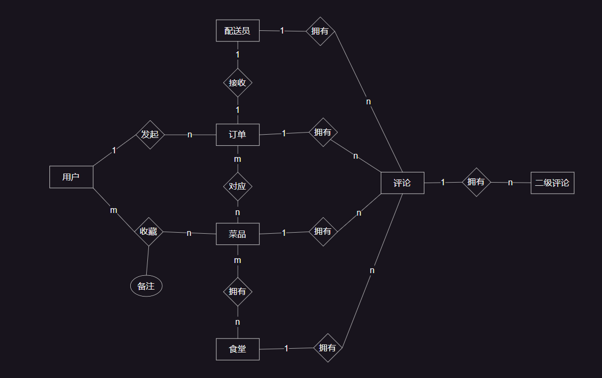

           
    《数据库系统原理》大作业 
    系统设计报告  
    题目名称:  食堂外卖配送系统
       
    
    
         
    
        学号及姓名 
        <u>21373488 黄融亮</u> 
        <u>21371107 鹿鸣  </u> 
        <u>20375038 吴思睿</u> 
            
        2023年10月29日
    

 
 
 
 
 
 
 
 

| 学生姓名 | 子任务1: 系统功能设计 与数据库设计 | 子任务2: 系统服务 器端开发                         | 子任务3: 系统客户 端开发                          | 工作占比 |
| -------- | ---------------------------------- | -------------------------------------------------- | ------------------------------------------------- | -------- |
| 黄融亮   | 想法讨论 需求分析 构造数据表      | 接口文档敲定 测试                                  | 前端布局美化 前端架构实现 网页测试 前后端代码测试 | 33%      |
| 鹿鸣     | 想法讨论 需求分析                  | 接口文档敲定 测试                                  | 前端布局美化 前端架构实现 网页测试 前后端代码测试 | 33%      |
| 吴思睿   | 想法讨论 需求分析 构造数据表       | 数据库连接 数据库存储定义与实现 后端架构设计与实现 | 前后端代码测试                                    | 34%      |

## 需求分析

### 需求描述

本项目旨在方便送餐人员与需要送餐人员的对接工作

对于买家:

- 注册: 输入学号、用户名、密码等进行注册
- 登录: 输入学校、密码，若账户正确且未被删号，则登录，反之则报错
- 个人信息管理: 修改头像, 密码等
- 查看食堂
- 查看菜品
- 收藏菜品
- 发起订单: 提供期望完成时间, 指定菜品, (食堂)
- 撤销未被接收的订单
- 查看过往订单
- 评论订单、配送员和商家
- 删除自己的评论
- 查看配送员、菜品和食堂评论

对于配送员:

- 查看目前的订单
- 接收订单
- 完成订单

对于食堂:

- 管理菜品信息(增删改)

对于管理员:

- 删除不合道德规范的评论

买家对于某个菜品发起订单，给出期望送达时间，配送员接收订单并线下购买后送到指定地点, 用户可以针对已完成的订单、配送员、某个食堂或菜品发起评论，也可以评论他人的评论

### 数据流图

#### 顶层简略数据流图

#### 用户功能数据流图

#### 评论数据流图

#### 订单数据流图

#### 菜品数据流图

### 数据元素表

图片表

| 属性名 | 中文   | 数据类型 |
| ------ | ------ | -------- |
| id     | 图片id | bigint   |
| img    | 图片   | blob     |

用户表

| 属性名         | 中文         | 数据类型 |
| -------------- | ------------ | -------- |
| id             | 用户id       | bigint   |
| account_number | 账号(工学号) | int      |
| password       | 密码         | varchar  |
| tele           | 电话号码     | bigint   |
| img_id         | 头像图片id   | bigint   |
| nick_name      | 昵称         | varchar  |

食堂表

| 属性名         | 中文         | 数据类型 |
| -------------- | ------------ | -------- |
| id             | 食堂id       | bigint   |
| name           | 食堂名       | varchar  |
| account_number | 账号(工学号) | int      |
| password       | 密码         | varchar  |
| tele           | 电话号码     | bigint   |
| description    | 描述         | varchar  |
| locate         | 地址         | varchar  |

配送员表

| 属性名         | 中文         | 数据类型 |
| -------------- | ------------ | -------- |
| id             | 配送员id     | bigint   |
| account_number | 账号(工学号) | int      |
| password       | 密码         | varchar  |
| tele           | 电话号码     | bigint   |
| img_id         | 头像图片id   | int      |
| real_name      | 实名         | int      |

菜品表

| 属性名      | 中文       | 数据类型 |
| ----------- | ---------- | -------- |
| id          | 菜品id     | bigint   |
| name        | 菜名       | varchar  |
| price       | 价格       | int      |
| description | 描述       | text     |
| tag         | 标签       | varchar  |
| canteen_id  | 所属食堂id | bigint   |

订单表

| 属性名               | 中文             | 数据类型 |
| -------------------- | ---------------- | -------- |
| id                   | 订单id           | bigint   |
| user_id              | 发起订单的用户id | bigint   |
| create_time          | 创建时间         | date     |
| expected_finish_time | 期望完成时间     | date     |
| status               | 订单状态         | int      |
| staff_id             | 配送员id         | bigint   |
| destination          | 目的地           | varchar  |

评论表

| 属性名      | 中文         | 数据类型 |
| ----------- | ------------ | -------- |
| id          | 评论id       | bigint   |
| content     | 评论内容     | text     |
| create_time | 创建时间     | date     |
| user_id     | 评论发布者id | bigint   |

评论-配送员表

| 属性名     | 中文     | 数据类型 |
| ---------- | -------- | -------- |
| comment_id | 评论id   | bigint   |
| staff_id   | 配送员id | bigint   |

评论-订单表

| 属性名     | 中文   | 数据类型 |
| ---------- | ------ | -------- |
| comment_id | 评论id | bigint   |
| order_id   | 订单id | bigint   |

评论-菜品表

| 属性名     | 中文   | 数据类型 |
| ---------- | ------ | -------- |
| comment_id | 评论id | bigint   |
| dish_id    | 菜品id | bigint   |

评论-食堂表

| 属性名     | 中文   | 数据类型 |
| ---------- | ------ | -------- |
| comment_id | 评论id | bigint   |
| canteen_id | 食堂id | bigint   |

用户-菜品收藏表

| 属性名  | 中文   | 数据类型 |
| ------- | ------ | -------- |
| user_id | 用户id | bigint   |
| dish_id | 菜品id | bigint   |
| note    | 备注   | varchar  |

一级评论-二级评论表

| 属性名      | 中文       | 数据类型 |
| ----------- | ---------- | -------- |
| comment1_id | 一级评论id | bigint   |
| comment2_id | 二级评论id | bigint   |

订单-菜品表

| 属性名   | 中文   | 数据类型 |
| -------- | ------ | -------- |
| order_id | 订单id | bigint   |
| dish_id  | 菜品id | bigint   |

## 数据库概念模式设计

### 系统初步E-R图

### 系统基本E-R图

分析初步E-R图, 我们发现菜品和食堂应该是 1 对多的关系, 每个食堂的同名菜品也应该拥有自己的价格, 描述... 将其修改为 1 对多关系后得到如下E-R图

## 数据库逻辑模式设计

### 数据库关系模式

- 图片表(`<u>`id `</u>`, img)
- 用户(`<u>`id `</u>`, account_number, password, tele, img_id, nick_name)
- 食堂(`<u>`id `</u>`, name, account_number, password, tele, description, locate)
- 配送员(`<u>`id `</u>`, account_number, password, tele, img_id, real_name, age)
- 菜品(`<u>`id `</u>`, name, price, description, tag, canteen_id)
- 订单(`<u>`id `</u>`, user_id, create_time, expected_finish_time, status, staff_id, destination)
- 评论(`<u>`id `</u>`, content, create_time, user_id)
- 评论-配送员(`<u>`comment_id `</u>`, `<u>`staff_id `</u>`)
- 评论-订单(`<u>`comment_id `</u>`, `<u>`order_id `</u>`)
- 评论-菜品(`<u>`comment_id `</u>`, `<u>`dish_id `</u>`)
- 评论-食堂(`<u>`comment_id `</u>`, `<u>`canteen_id `</u>`)
- 用户-菜品收藏表(`<u>`user_id `</u>`, `<u>`dish_id `</u>`, note)
- 一级评论-二级评论(`<u>`comment1_id `</u>`, `<u>`comment2_id `</u>`)
- 订单-菜品(`<u>`order_id `</u>`, `<u>`dish_id `</u>`)

### 规范判定

- 订单表(id, user_id, create_time, expected_finish_time, status, staff_id, destination)
  唯一候选码id, 其它属性完全依赖于id, 属于BCNF
- 评论表(id, content, create_time, user_id)
  唯一候选码id, 其它属性完全依赖于id, 属于BCNF
- 评论-配送员表(comment_id, staff_id)
  全码, 属于BNCF
- 评论-订单表(comment_id, order_id)
  全码, 属于BNCF
- 评论-菜品表(comment_id, dish_id)
  全码, 属于BNCF
- 评论-食堂表(comment_id, canteen_id)
  全码, 属于BNCF
- 用户-菜品收藏表(user_id, dish_id, note)
  唯一候选码(user_id, dish_id), note完全依赖于该码, 属于BCNF
- 一级评论-二级评论表(comment1_id, comment2_id)
  全码, 属于BNCF
- 订单-菜品表(order_id, dish_id)
  全码, 属于BCNF

### 数据库设计优化

#### 索引优化

对于所有的表，我们都建⽴了主码的索引，因为⼤多数查询是基于主码进⾏的。

#### 使⽤外键

使⽤外键来保证数据的关联性并提⾼访问速度，同时在使⽤过程中保证数据的参照完整性。在本项⽬的后端数据库中，各表具有完备的外键联系，通过遵循这种外键关系进⾏实际数据库的建⽴，将从逻辑的⻆度保证数据库的设计功能能够完全正确执⾏到位。

#### 优化查询语句

可以优化的地⽅有如下⼏点:

- 在⼤多数情况下，联表查询⽐嵌套查询更有效，因此能使⽤联表查询的地⽅尽可能使⽤联表查询⽐较⾼效
- 尽可能不将查询语句放在循环内也是⼀种优化的⽅法
- 避免在查询中使⽤复杂的函数以及 LIKE 关键词也是⼀种优化⽅法
  通过使⽤较好的 ORM 框架可以解决以上问题
